# Pixel Rice — reference-led review revision

This prototype lives only on `feature/immersive-redesign`. The first visual proposal was rejected; this revision follows the supplied cinematic boards more closely. Production has not been merged or deployed.

## What changed in this revision

- Replaced the oversized serif presentation with light, uppercase Manrope, wide tracking and quieter compositions. The navigation logo's markup and original styles remain unchanged.
- Made the hero a grain-led entry. It develops into a curved grain field on the existing founder timeline. The original team now appears as three staggered portrait planes in People; their original image files are unchanged. Selecting a name with a mouse, keyboard or touch enlarges and emphasizes that person.
- Restored production section durations: 4 / 1 / 10 / 3 / 1.5 / 2, with the existing 1.05 padding. Retained ScrollEngine, scroll math, descending project camera, focal windows and compositor architecture.
- Retained the instanced rice geometry, shader spin/drift, velocity response and burst behavior. Repositioned grains into curved fields and project wreaths, with varied scale and density. Increased the field density selectively; phone counts and render resolution remain capped.
- Replaced the first prototype's frames/slats with a shared stone, thin reflective glass, chrome and paper composition. Stone uses procedural surface detail; glass uses an inexpensive coated transparent material. No new runtime dependency or external material asset was added.
- Kept the original diagonal scene wipe, but removed its RGB separation and bright flash, and reduced noise/displacement for the quieter material direction. These are shader presentation changes, not changes to scroll timing or progression.
- Positioned real project imagery on the left and metadata on the right. Image sampling preserves the full screenshot at rest; rice-edged reveals and the existing camera connect each project. Removed unrelated sculptural interludes between projects. Work navigation now lands at the first project's readable focal point.
- Centered the contact statement and pill CTA within a calm rice ring. Simple view and the OS reduced-motion preference use static rice shapes, complete project imagery, all project links and the same team controls.

## Portraits embedded in the material scene

The three existing glass panels now contain the original Junes, Deepan and Shikhar portraits. The images are mounted in each pane's local coordinates, beneath the reflective surface, with restrained color and soft edge transparency. Face-preserving crops retain the original image proportions. Portrait textures load when the material scene first becomes active and are disposed with that scene. The phone composition is slightly smaller to keep all three portraits in view. The dedicated People section and original image files are unchanged.

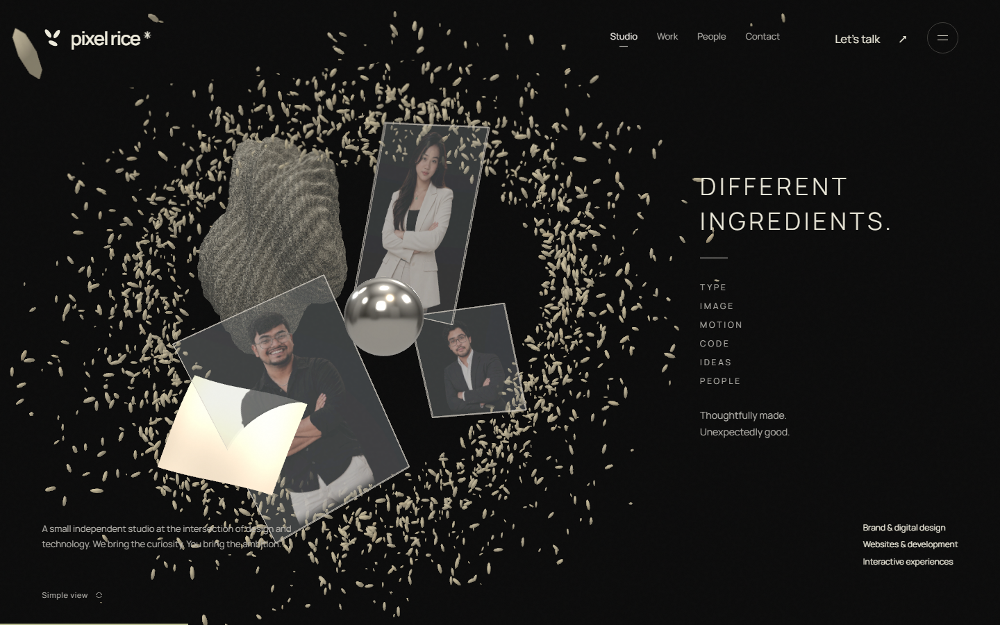
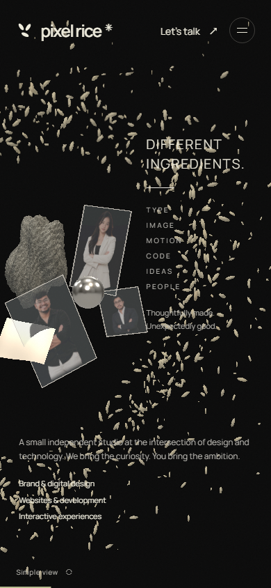

## Review locally

From `pixel-rice-studio`:

```sh
npm ci
npm run build:pages
node scripts/preview-pages.mjs 3004
```

Open [the local review](http://127.0.0.1:3004/pixel-rice/). This address works on the machine running the preview. The production site remains unchanged.

For development: `npm run dev -- --port 3003`.

## Verification

- Production-style static build passed under `/pixel-rice/`, including TypeScript validation. Initial route JavaScript is approximately 115 kB; Three.js is loaded separately.
- All 12 existing contact, motion, descending-camera, transition and lifecycle tests passed.
- Chromium browser checks covered 1440×900 desktop and touch layouts at 390×844, 375×667 and 652×698. No horizontal document overflow or project-caption/control overlap was found at those sizes.
- Clicked all five project title links. KAO MING, Sunset Bar, Harborside Coffee, Tide House and Takao Pantry opened their public websites and returned HTTP 200. Links never target repository pages; CRM remains excluded.
- Checked project dialog Escape/focus restoration, founder selection, contact dialog, native wheel scrolling in both directions over artwork, document endpoints and Simple view off/on renderer recovery.
- Emulated the OS reduced-motion preference: no canvas, static rice, complete project image and accessible project links. Mobile menus were exercised with touch emulation.
- No JavaScript or shader errors were observed. Original logo markup and all four founder image files were checked against main; the three visible identities were also compared with the original team image.

These are local Chromium and touch-emulation checks. Real Safari/iOS, low-end Android GPU behavior and throttled-network performance still require device review. The procedural materials are a prototype interpretation of the boards, not photorealistic replicas. No universal FPS claim is made.

The contact inbox is still unconfigured. The static preview offers to save a project brief and does not claim that an inquiry was sent.

## Architecture and Graphify

See `reference-revision-plan.md` for the plan written before this revision. The first prototype's `immersive-redesign.md` is retained as historical context; the decisions above supersede its rejected visual direction.

The earlier Graphify scan remains in the ignored local `artifacts/redesign-analysis/graphify-out/` folder. It mapped the single scroll engine, scene compositor, project data and components. That snapshot predates this visual revision and is not a fresh validation of the current source.

## Current screenshots

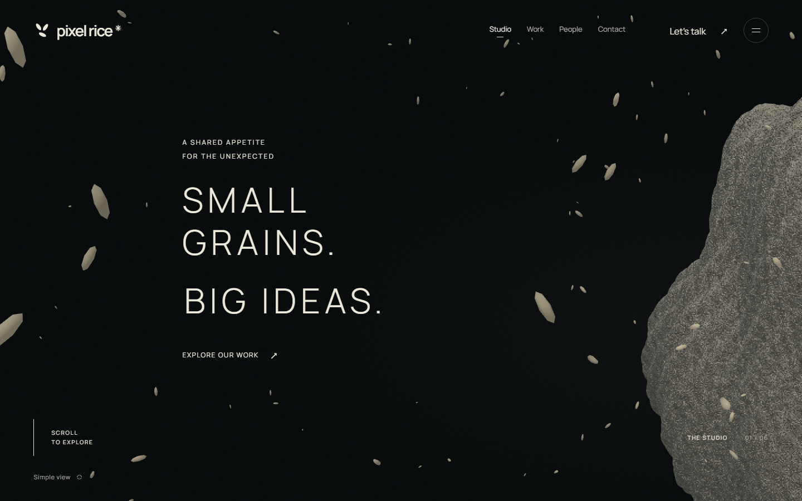
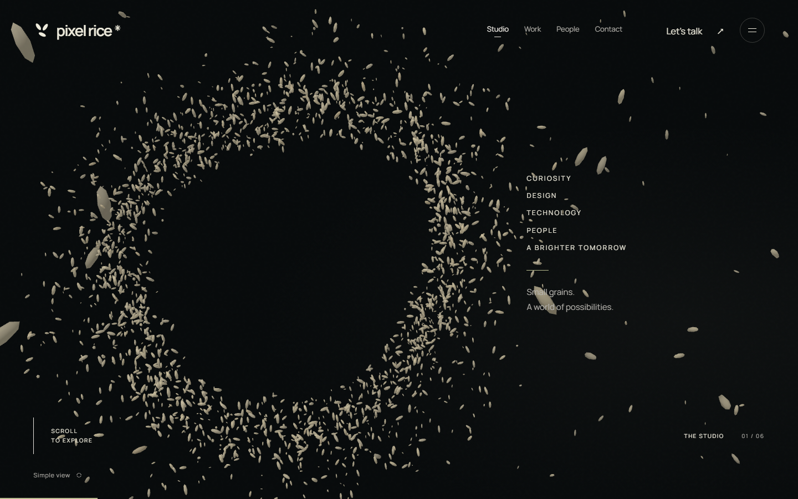
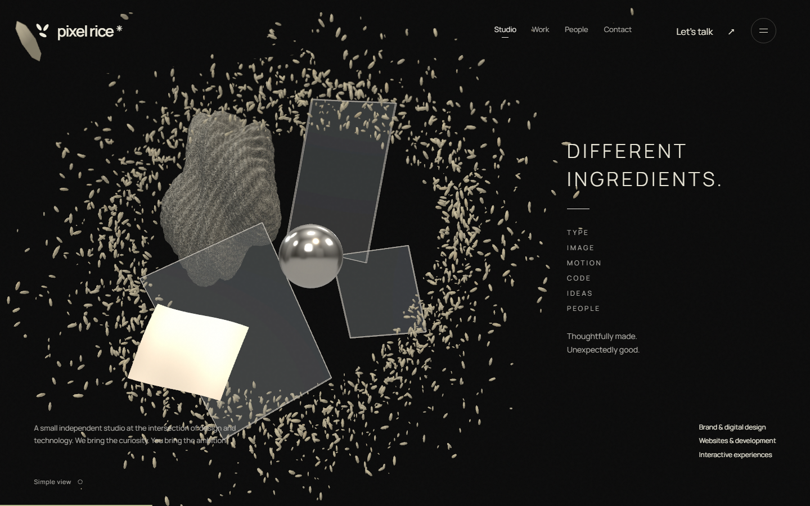
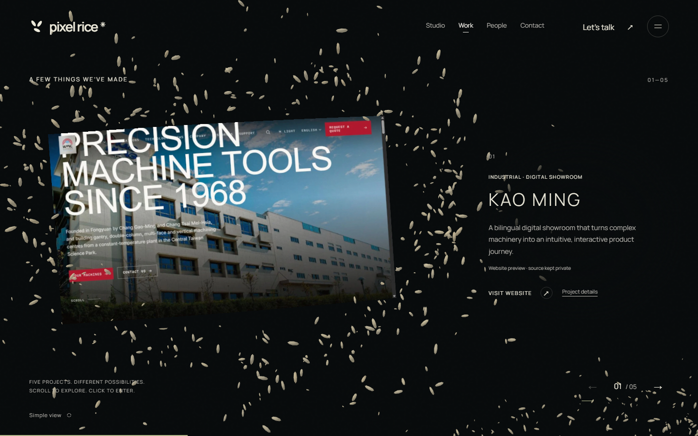
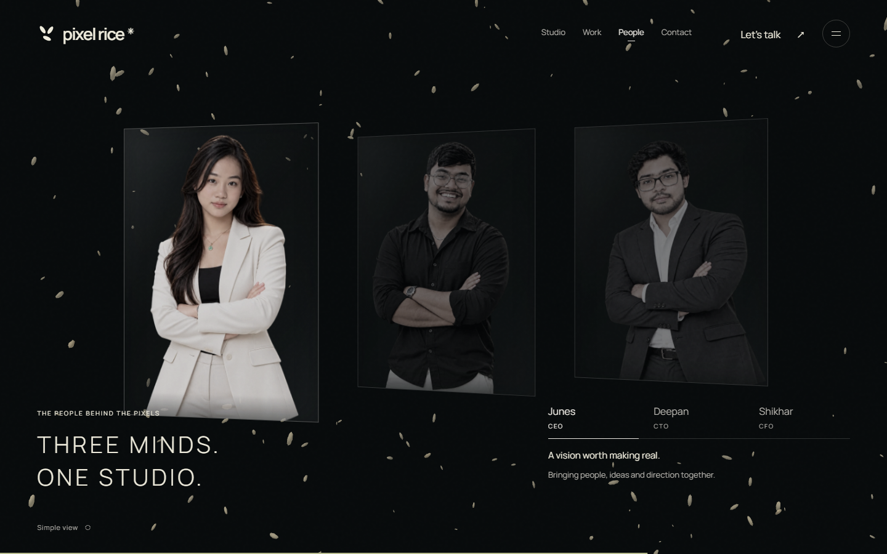
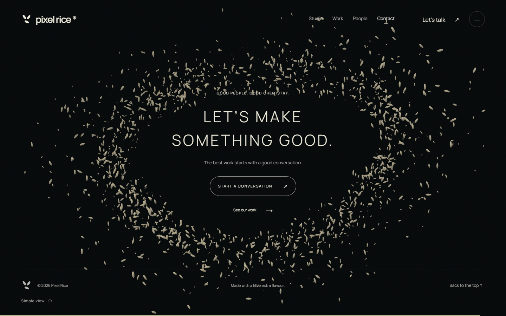
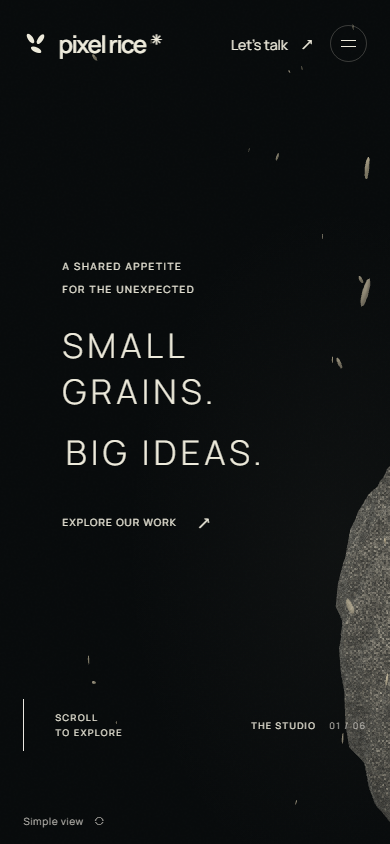
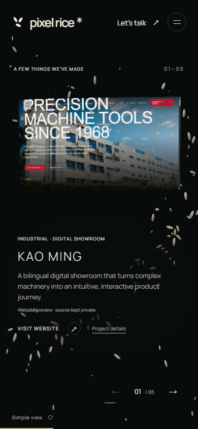
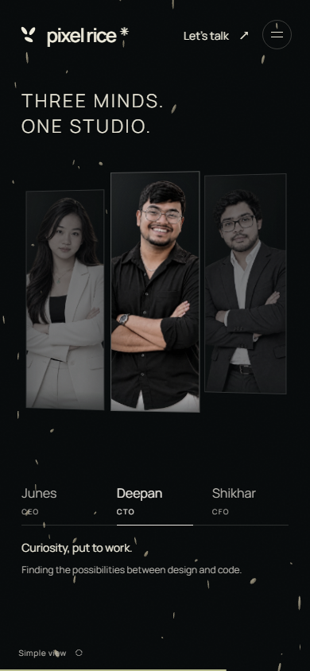
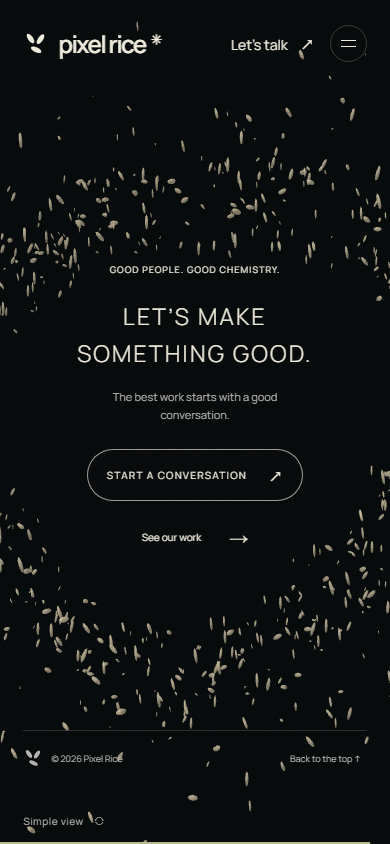

The earlier unversioned screenshots remain in `review/` for comparison; they show the rejected first prototype.
