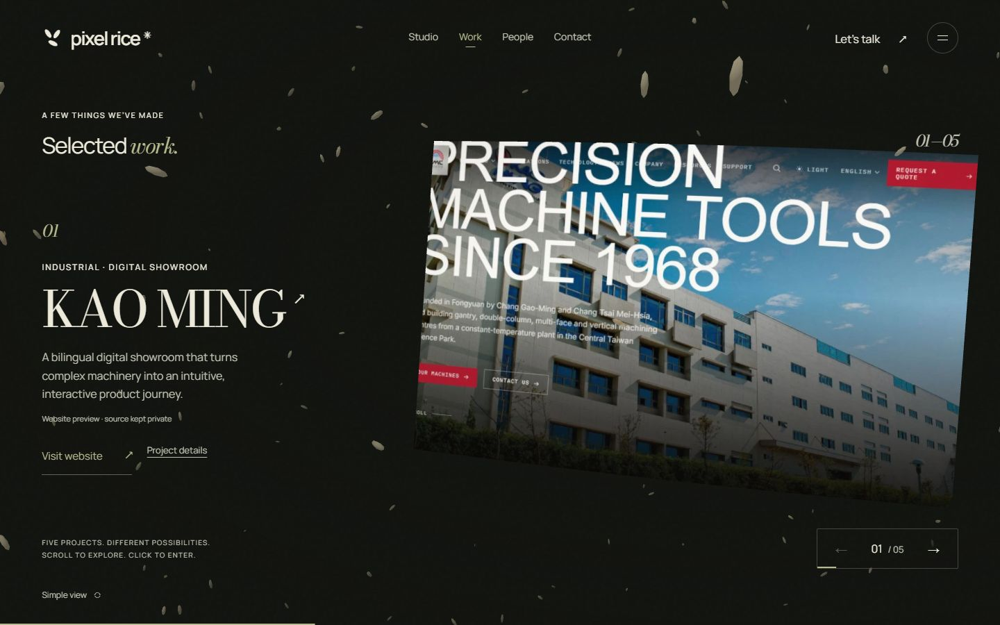

# Pixel Rice immersive redesign — review prototype

This implementation lives on `feature/immersive-redesign`. It is ready for visual review; no merge or production deployment has been performed.

## What changed

- Replaced literal food models with a shared family of paper, stone, glass and metal compositions, using the existing renderer and descending camera path.
- Preserved the rice instancing system with a lighter density, coordinated studio typography and project masks, plus restrained project-specific distortion/cropping.
- Added a dedicated People section. Mouse hover, keyboard focus and clicking/tapping each name select that founder; the others recede. The original hero's group and individual portraits remain.
- Enlarged supporting text, made desktop navigation persistent and simplified the final conversation actions.
- Added screenshots of four public project websites; preserved Harborside Coffee's existing screenshot. All five projects link directly to their websites. CRM remains excluded. Demo/concept status remains explicit.
- Added an automatic calm presentation for the OS reduced-motion preference, paused the renderer while the document is hidden and capped mobile rendering resolution. Fixed a cleanup bug that could prevent returning from Simple view to the immersive renderer.

## Preview locally

From `pixel-rice-studio`:

```sh
npm ci
npm run build:pages
node scripts/preview-pages.mjs 3004
```

Open http://127.0.0.1:3004/pixel-rice/ . This is a local review server, not the production website.

For development, use `npm run dev -- --port 3003`.

## Verification

- TypeScript and production compilation passed. Static export passed with the `/pixel-rice` base path; first-load route JavaScript is 115 kB, with the Three.js scene loaded separately.
- All 12 existing contact, native-scroll, descending-camera, transition and lifecycle tests passed.
- Browser checked at 1440×900, 390×844 and 375×667: hero, project navigation, project details, People selection, contact dialog and calm mode. No horizontal document overflow was observed at the tested phone widths.
- All five website destinations were inspected in the rendered navigation. Clicking the Takao artwork opened its public website in a new tab. Escape closed the project dialog and restored the trigger focus. Tab reached the calm-mode artwork link.
- Tested Simple view on → off after renderer disposal: canvas removed in Simple view and restored when immersive mode resumes.
- Static assets loaded successfully under the production-style base path. No WebGL shader errors were observed in browser checks.
- Logo markup and original logo styles were retained. All four founder image files are unchanged from the branch base.

Real Safari/iOS hardware, low-end Android performance, a throttled network and the OS preference switch were not exercised in this environment. The preference logic is covered by the existing tests; the equivalent calm presentation was exercised in the browser. No universal FPS claim is made.

The contact inbox remains unconfigured. The current preview clearly offers to save a project brief and does not claim to send an inquiry.

## Graphify

The final `src` scan contains 25 files, 131 nodes, 308 relationships and seven communities. No import cycles were detected. Structural extraction reported 20 dangling endpoints and three collapsed relationship pairs; these are recorded as limitations of the generated map, not treated as proven application defects. The local report, graph JSON and interactive HTML are in `artifacts/redesign-analysis/graphify-out/` and are excluded from the site bundle and Git.

The most connected nodes are `ScrollEngine`, `clamp`, `SectionId`, `assetPath` and `SectionCompositor`. The map links `createMaterialScenes` to the existing camera functions, and `PeopleDepth` to the shared base-path helper. It supports tracing how the single scroll engine coordinates navigation, UI, scenes and compositing.

## Screenshots

Desktop hero:


Desktop work:



Phone hero:


